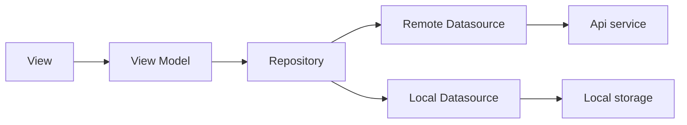
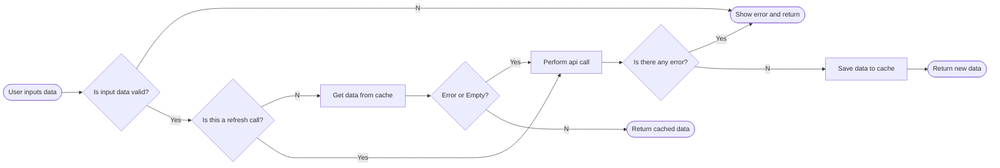

# Weather Forecast

Author: Anh Vu

## Architecture / Patterns

This app uses MVVM architecture with Android Architecture Components, combined with Dependency Injection and Repository Pattern.

Main language: Kotlin

## Key libraries / frameworks

- Android Architecture Components
- Android databinding
- Dagger Hilt (for DI)
- Retrofit + RxJava3 for calling network api and handling multi thread

## Project folder structure

- api: Contains all remote api service interfaces
- di: Contains dagger hilt DI modules and components
- models: Contains all data models
- repositories: Contains all interfaces and implementations for each Repository, as well as theirs data sources
- ui: Constains all UI components (Activity, Fragment, Recycler View Adapter and View Model) for each screen
- utils: Contains all utility files, classes

## Feature Checklist

- [x] 1. The application is a simple Android application which is written by Kotlin.
- [x] 2. The application is able to retrieve the weather information from OpenWeatherMapsAPI.
- [x] 3. The application is able to allow user to input the searching term.
- [x] 4. The application is able to proceed searching with a condition of the search term length
- [x] must be from 3 characters or above.
- [x] 5. The application is able to render the searched results as a list of weather items.
- [x] 6. The application is able to support caching mechanism so as to prevent the app from
- [x] generating a bunch of API requests.
- [x] 7. The application is able to manage caching mechanism & lifecycle.
- [x] 8. The application is able to handle failures.
- [x] 9. The application is able to support the disability to scale large text for who can't see the text
         clearly.
- [ ] 10.The application is able to support the disability to read out the text using VoiceOver
  controls.

### Cache handling flow

## Steps to run the app

1. Download this file [here](https://drive.google.com/file/d/1MW0WcWo2EPJycFLGs8CJ7uJW6673z5VU/view?usp=sharing)
2. Put above file into project's root folder
3. Open project using Android Studio
4. Build the app as normal

## Room for improvements

- Separate the data layer (repository, data sources, data models, api services...) into a separate module, for a cleaner app structure
- Incorporate with above, we can add a domain layer for handling business logics if needed
- Since this is just a simple app, there is no need for base classes. But for the real project, adding base classes is a must.
- All strings are hard-coded, should not do this in real project
- Divide view model's functions into smaller one for easier and better unit test writing, as well as extending
- This project is using a simple version of cache, in which store the response json string in shared-preferences. This should be put in local database for larger, more complex data.
- Current cache refresh mechanism is very simple too: We clear all the cache when app opened and refresh a specific city when user performs a pull to refresh.  
- Use Debounce for searching while typing instead of clicking on Search button